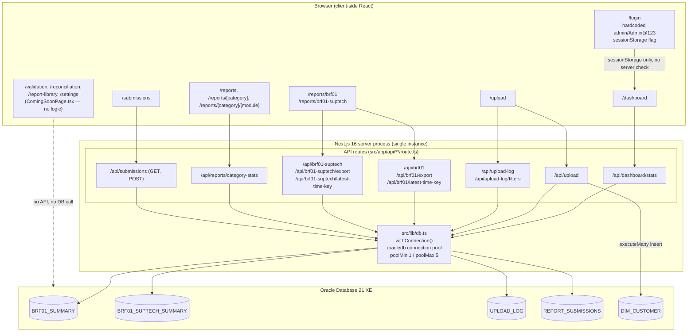
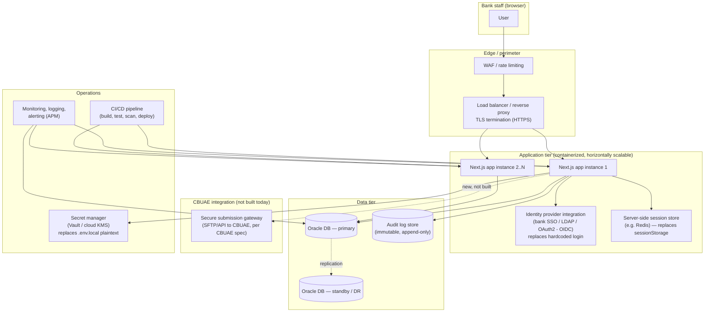

# 03 — System Architecture

## Current prototype architecture (as built)

The application is a single Next.js process serving both the UI (App Router pages, all client components — every page file inspected begins with `"use client"`) and the backend (API routes under `src/app/api/**/route.ts`). There is no separate backend service, no message queue, no cache layer, and no reverse proxy configured in the repository. It connects directly to a single Oracle Database instance via a module-level connection pool (`src/lib/db.ts`).

Authentication is entirely client-side: `src/app/login/page.tsx` compares the entered credentials against two hardcoded constants and, on match, writes flags into the browser's `sessionStorage`. Every protected page then calls `src/lib/useRequireAuth.ts` on mount, which just re-reads those same `sessionStorage` flags — there is no server-side session, cookie, or token, and **no API route checks who is calling it**.

### Key architectural characteristics observed in code

- **Monolithic, single-process.** No microservices, no serverless functions beyond what Next.js API routes already are, no worker processes.
- **Direct DB access from route handlers.** Every API route imports `withConnection` from `src/lib/db.ts` and issues SQL inline in the route file itself — there is no repository/DAO layer, no ORM.
- **Static report catalog, not database-driven.** The full "which reports exist" list lives in the TypeScript file `src/lib/reportCategories.ts`, not in a database table. Adding a new report type currently requires a code change and redeploy, not a config change.
- **No caching layer.** Every dashboard/report page load re-queries Oracle directly (see `src/app/api/dashboard/stats/route.ts`, which loops over every submittable report and issues two `COUNT(*)` queries per report on every request).
- **File uploads processed in-memory, synchronously**, within the request lifecycle of `POST /api/upload` (`src/app/api/upload/route.ts`): the file is buffered fully into memory (`Buffer.from(await file.arrayBuffer())`), parsed with `exceljs`, and inserted row-by-row via `connection.executeMany`. There is no background job queue or async processing.
- **No externally-facing integration.** Nothing in the codebase calls out to CBUAE or any third-party system.

## Recommended production architecture

The diagram below is a **proposal**, not a description of anything currently implemented. It addresses the gaps catalogued in `06-Security-Assessment.md` and `12-Risks-and-Roadmap.md`: real authentication/authorization, a proper session/identity layer, TLS termination, environment separation, and a supportable deployment story for a regulated banking workload.

### What changes vs. the current prototype

| Concern | Prototype (today) | Recommended production |
|---|---|---|
| AuthN | Hardcoded credentials in `src/app/login/page.tsx` | Bank SSO / LDAP / OIDC integration, no credentials in source |
| AuthZ | None (no role concept anywhere in code) | Role-based access control (maker/checker, report-level permissions) |
| Session | `sessionStorage` flag, client-only, forgeable via devtools | Server-verified session (signed cookie / JWT + server session store) |
| Transport | Not configured (dev server is plain HTTP) | TLS/HTTPS terminated at load balancer, enforced end-to-end |
| Secrets | Plaintext in `.env.local` | Centralized secret manager, injected at runtime |
| Deployment | `npm run dev` / `start-dev.bat` on a developer machine | Containerized, CI/CD-deployed, horizontally scalable |
| Data tier | Single Oracle instance, no DR mentioned | Primary + standby/DR, backup policy |
| Audit | `UPLOAD_LOG` and `REPORT_SUBMISSIONS` tables only | Full, immutable audit trail of all user actions, not just uploads/submissions |
| CBUAE transmission | Manual, external to the app (tracked, not performed) | Either remains manual-with-tracking (acceptable if that's the bank's chosen model) or a real, spec-compliant submission gateway is added — this is a business decision, not just a technical one |

See `07-Deployment-Guide.md` for concrete steps toward this target and `08-Prototype-vs-Production.md` for the full side-by-side comparison.
