# 05 — Data Flow and Report Generation

## End-to-end flow, as actually implemented

```mermaid
flowchart LR
    A["User has a .xlsx/.csv file\nnamed DIM_CUSTOMER_YYYYMMDD.xlsx"] --> B["/upload page\nsrc/app/upload/page.tsx"]
    B -->|"detectUploadTable() client-side pre-check\nsrc/lib/uploadTables.ts"| C{Filename matches\na known table?}
    C -->|No| D["Error shown, upload blocked"]
    C -->|Yes| E["Confirm-upload modal\n(user confirms target table)"]
    E --> F["POST /api/upload\nsrc/app/api/upload/route.ts"]
    F --> G["Parse workbook with exceljs\nnormalize + validate headers"]
    G --> H{"Row has all\nrequired columns?"}
    H -->|No| I["Row skipped, reason logged"]
    H -->|Yes| J["connection.executeMany()\nbulk INSERT into DIM_CUSTOMER"]
    J --> K[(DIM_CUSTOMER table)]
    F --> L["logUpload()\nINSERT INTO UPLOAD_LOG"]
    L --> M[(UPLOAD_LOG table)]

    K -.->|"NOT IMPLEMENTED IN THIS CODEBASE:\nno visible ETL/aggregation step\nfrom DIM_CUSTOMER into\nBRF01_SUMMARY / BRF01_SUPTECH_SUMMARY"| N[("BRF01_SUMMARY\nBRF01_SUPTECH_SUMMARY\n(populated by an external/unknown process)")]

    N --> O["GET /api/brf01\nGET /api/brf01-suptech\nsrc/app/api/brf01*/route.ts"]
    O --> P["On-screen filterable table\nsrc/app/reports/brf01/page.tsx\nsrc/app/reports/brf01-suptech/page.tsx"]
    P --> Q["Download Report button"]
    Q --> R["GET /api/brf01/export\nGET /api/brf01-suptech/export"]
    R --> S["exceljs workbook generated\nsrc/lib/excelReportTemplate.ts"]
    S --> T[".xlsx file downloaded\nto user's machine"]

    T -.->|"Manual, outside this application\n(email, CBUAE portal, courier, etc.)"| U["CBUAE"]
    T --> V["User returns to /submissions"]
    V --> W["POST /api/submissions\nMark as submitted (self-reported)"]
    W --> X[(REPORT_SUBMISSIONS table)]
```

## Stage-by-stage detail

### 1. Upload

- Entry point: `src/app/upload/page.tsx`.
- File name convention is strict: `<TABLE_KEY>_YYYYMMDD.xlsx` or `.csv`, enforced by the regex in `fileNamePattern()` in `src/lib/uploadTables.ts`.
- Only **one** destination table is currently configured: `DIM_CUSTOMER`, with two required columns (`customer_name`, `customer_number`) — see `UPLOAD_TABLES` in `src/lib/uploadTables.ts`.
- The API route `src/app/api/upload/route.ts` re-validates everything the client already checked (never trust the client) — file extension, `timeKey` format, filename-to-table match, and a `confirmedTable` field that must match what the server itself detects.
- Rows missing any required field are **skipped** (not inserted, but logged with a reason) rather than failing the whole batch.
- Every upload attempt — successful or not — is recorded in `UPLOAD_LOG` via `logUpload()`, including total/inserted/failed row counts.

### 2. "Validation" — does not exist as a processing step

There is **no validation engine** in this codebase beyond the upload-time checks described above (file extension, date format, required-column presence, per-row required-field presence). The `/validation` page (`src/app/validation/page.tsx`) renders `ComingSoonPage` with the description "Automated checks against generated reports will appear here once the validation engine is built." **This is accurate: no such engine exists yet.** There is no rule engine, no cross-field check, no regulatory-threshold check, and no linkage between uploaded data and report output beyond whatever aggregation already lives in the (external, unknown-to-this-repo) process that populates `BRF01_SUMMARY`/`BRF01_SUPTECH_SUMMARY`.

### 3. Report generation

- **Important gap identified by code inspection:** the two live reports (BRF 01 - Assets and BRF 1.1 - Assets) read from `BRF01_SUMMARY` and `BRF01_SUPTECH_SUMMARY` respectively (see `src/app/api/brf01/route.ts` line referencing `FROM BRF01_SUMMARY`, and `src/lib/brf01SupTechTemplate.ts`'s `BRF01_SUPTECH_TABLE` constant). **A repo-wide search found no `INSERT`, `UPDATE`, or `MERGE` statement anywhere in `src/` that writes to either table.** The only table the app's own upload pipeline writes to is `DIM_CUSTOMER`. This means the data these two reports display must be populated by some process **outside this codebase** — a manual Oracle script, a separate ETL job, or direct SQL by a DBA. **Not identifiable from the current codebase** how or how often that happens. This is a material fact for anyone assuming "upload data → see it in the report" is an automated pipeline today: it is not, for the two live reports.
- Once data is in `BRF01_SUMMARY`/`BRF01_SUPTECH_SUMMARY`, report rendering itself is: a `GROUP BY line_no` SQL aggregation with optional filters (`timeKey`, `entityGroup[]`, `dataSource[]`) → mapped onto a fixed, hardcoded row template (`BRF01_TEMPLATE` in `src/lib/brf01Template.ts`, 90+ rows matching the official CBUAE BRF 01 form layout) → rendered as an HTML table in the report page.
- Rows with no matching data show as blank (`EMPTY_METRICS`), not as an error — the report always renders the full official form shape regardless of how much data exists.

### 4. Export

- `GET /api/brf01/export` and `GET /api/brf01-suptech/export` re-run the identical aggregation query (there is some duplication here — the export routes do not reuse the on-screen JSON endpoint's logic, they re-implement the same SQL) and stream back an `.xlsx` file built with `exceljs`, using shared styling helpers in `src/lib/excelReportTemplate.ts` so the exported file visually matches CBUAE's expected column/header layout (RESIDENT/NON-RESIDENT/TOTAL × AED/FCY × A/cs/Amount).

### 5. Submission to CBUAE — manual and external to this system

- **There is no code that transmits anything to CBUAE.** The exported `.xlsx` file is downloaded to the user's machine by the browser (`window.location.href = "/api/brf01/export?..."`, in `src/app/reports/brf01/page.tsx`). What happens to that file next (uploaded to a CBUAE web portal, emailed, etc.) is entirely outside this application.
- The `/submissions` page (`src/app/submissions/page.tsx`) and `POST /api/submissions` (`src/app/api/submissions/route.ts`) exist purely to let a user **self-report** that a given report/period was submitted, optionally backdating the timestamp to when it actually happened. This is a tracking/reminder mechanism, not a control — nothing verifies the claim.

### 6. "Reconciliation" — does not exist

The `/reconciliation` page (`src/app/reconciliation/page.tsx`) is a `ComingSoonPage` stub ("GL-vs-BRF break analysis will appear here once reconciliation logic is built"). No GL data source, comparison logic, or break-reporting exists anywhere in the code.

## Summary of "what's real vs. what's a label"

| Step in the business process | Status |
|---|---|
| Upload a file | **Real** — `src/app/api/upload/route.ts` |
| Validate uploaded file structure/required fields | **Real, but shallow** — presence/format checks only, no business-rule validation |
| Validate a *generated report* against regulatory rules | **Not implemented** (`/validation` is a stub) |
| Load uploaded data into the BRF01/BRF01-SupTech summary tables | **Not identifiable from the current codebase** — no ETL code found; must happen externally |
| Generate/view BRF 01 and BRF 1.1 reports | **Real** — `src/app/api/brf01*/route.ts` |
| Export to Excel | **Real** — `src/app/api/brf01*/export/route.ts` |
| Reconcile against GL | **Not implemented** (`/reconciliation` is a stub) |
| Transmit report to CBUAE | **Not implemented** — manual, outside the application |
| Track that a submission happened | **Real, but self-reported** — `src/app/api/submissions/route.ts` |
